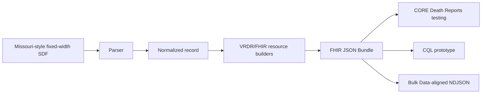

# FHIRBridge-MO

**Legacy Missouri-style death-certificate data → VRDR/FHIR R4 → cancer-registry interoperability testing**

FHIRBridge-MO is a proof-of-concept public-health informatics project that explores how a legacy fixed-width mortality file can be transformed into standards-oriented **HL7 FHIR R4 / Vital Records Death Reporting (VRDR)** resources for cancer-registry death-clearance workflows.

The current repository contains a **synthetic-data MVP** only. It is intended for development, learning, interoperability testing, and research—not production clinical or registry use.

> **Status:** Developer-reference prototype. Synthetic data only. Successful CORE import of the FHIRBridge-MO-generated bundle are being evaluated.

## Why this project exists

Cancer registries use mortality data to:

- identify deaths and update vital status;
- link death certificates to existing registry records;
- investigate unmatched cancer-related deaths; and
- support death-certificate-only (DCO) follow-back.

Missouri's mortality workflow uses a fixed-width file in which meaning depends on known character positions. FHIRBridge-MO separates the legacy file parser from the FHIR builders so that a local source format can be translated into explicit, standardized resources.



## Current MVP

The prototype demonstrates:

- parsing of 245- and 249-character synthetic fixed-width records;
- normalization of selected dates and source fields;
- mapping of selected mortality fields into VRDR/FHIR concepts;
- generation of UUID-linked FHIR resources and Bundles;
- a CORE-template-aligned synthetic JSON example;
- a prototype CQL rule for first-pass cancer-coded-death flagging; and
- resource-type NDJSON output for bulk-oriented testing.

### Selected source-to-FHIR mapping

| Source field | Meaning | FHIR / VRDR target |
|---|---|---|
| `certno` | Death certificate number | `Parameters.cert_no` + document identifier |
| `stmocd` | State / jurisdiction | `Parameters.jurisdiction_id` |
| `fname`, `lname`, `sex`, `dob` | Decedent identity | `Patient / vrdr-decedent` |
| `deathdate` | Date of death | `Observation / vrdr-death-date` |
| `por_name`, address, city, state, ZIP | Death institution / location | `Location / vrdr-death-location` |
| `cause` | Underlying ICD-10 cause of death | `Observation / vrdr-automated-underlying-cause-of-death` |

See [`mapping/SyntheticDCOtoFHIRmapping.csv`](mapping/SyntheticDCOtoFHIRmapping.csv) for the field-level mapping.

## FHIR technologies

- **FHIR R4**
- **HL7 VRDR**
- FHIR JSON Bundles
- CQL prototype packaged as a FHIR `Library`
- Bulk Data-aligned NDJSON prototype

## Repository layout

```text
FHIRBridge-MO/
├── README.md
├── requirements.txt
├── .gitignore
├── CITATION.cff
├── CONTRIBUTING.md
├── SECURITY.md
├── DISCLAIMER.md
├── CHANGELOG.md
├── src/
│   ├── create_mo_fhir_from_sdf_jupyter_CDC_RegistryPlus_CORE.py
│   └── export_bulk_fhir_ndjson_jupyter.py
├── examples/
│   ├── MCR_DEATH_2024_SYNTHETIC.txt
│   ├── MCR_DEATH_2024_SYNTHETIC_MO_FHIR_CORE_TEMPLATE_ALIGNED.json
│   └── bulk_ndjson/
├── mapping/
│   ├── SyntheticDCOtoFHIRmapping.xlsx
│   └── SyntheticDCOtoFHIRmapping.csv
├── cql/
│   ├── FHIRBridge_MO_Cancer_FollowBack_Prototype.cql
│   └── FHIRBridge_MO_CQL_Library.json
├── docs/
│   ├── architecture.md
│   ├── data-mapping.md
│   ├── testing.md
│   └── roadmap.md
└── reference/
    └── README.md
```

## Quick start

### 1. Requirements

- Python 3.10+ recommended
- Anaconda/Jupyter optional
- No third-party Python packages are required by the core converter

### 2. Prepare the synthetic input

The example input is:

```text
examples/MCR_DEATH_2024_SYNTHETIC.txt
```

It contains **synthetic records only**.

### 3. Run the developer-reference converter

The current converter uses a configurable `BASE_FOLDER` near the beginning of the script.

For Jupyter:

```python
%run src/create_mo_fhir_from_sdf_jupyter_CDC_RegistryPlus_CORE.py
```

Before running, update `BASE_FOLDER`, `INPUT_FILE`, and `OUTPUT_FILE` for your local environment.

> The current converter script is a developer-reference implementation and does **not** by itself prove CORE compatibility or VRDR conformance.

### 4. Review the CORE-template-aligned example

The repository also contains:

```text
examples/MCR_DEATH_2024_SYNTHETIC_MO_FHIR_CORE_TEMPLATE_ALIGNED.json
```

This file was prepared to closely follow the structure of a known CDC Registry Plus CORE FHIR sample while retaining Missouri synthetic values. It is useful for parser/import troubleshooting.

**Important:** structural alignment with a reference file is not equivalent to standards validation.

## CORE testing status

A reference FHIR bundle was successfully imported into the CORE **Death Reports preprocessing** area with two records and no parsing failures. That establishes a baseline for the CORE import pathway.

The Missouri-generated/template-aligned example remains a test artifact until its own import behavior and VRDR validation are documented.

See [`docs/testing.md`](docs/testing.md).

## CQL prototype

[`cql/FHIRBridge_MO_Cancer_FollowBack_Prototype.cql`](cql/FHIRBridge_MO_Cancer_FollowBack_Prototype.cql) demonstrates a simple first-pass rule:

> flag a potential cancer-coded death when the standardized underlying-cause Observation contains an ICD-10 code beginning with `C`.

This is **not** the Missouri Cancer Registry's production DCO selection algorithm.

## Bulk-oriented NDJSON

The optional exporter writes one FHIR resource per line, grouped by resource type, for example:

- `Patient.ndjson`
- `Observation.ndjson`
- `Location.ndjson`

This is **Bulk Data-aligned NDJSON**, not a complete implementation of the server-side FHIR Bulk Data `$export` protocol.

## Data safety

This public repository should contain **synthetic data only**.

Do not commit:

- real death-certificate files;
- Social Security numbers or other direct identifiers;
- real patient names, addresses, or dates;
- database backups;
- connection strings, passwords, API keys, or secrets;
- internal server names or restricted configuration files.

See [`SECURITY.md`](SECURITY.md).

## Known limitations

- The project uses a reduced synthetic mortality layout.
- Not all source fields needed for a complete VRDR death certificate are present.
- Some resources/values in the CORE-template-aligned sample are explicitly synthetic scaffolding used to preserve reference structure.
- `state_auxiliary_id` is not available in the reduced Missouri source; any value used in a synthetic troubleshooting artifact must not be interpreted as operational data.
- The developer-reference Python converter and the template-aligned example represent different stages of the prototype and should not be assumed to be byte-for-byte equivalent outputs.
- Successful parsing by CORE does not prove VRDR conformance.
- The CQL rule is demonstration logic only.
- The NDJSON exporter is not a full Bulk Data `$export` implementation.

## Roadmap

1. Validate generated resources against applicable VRDR profiles.
2. Test FHIRBridge-MO-generated output in non-production CORE.
3. Document parser/import errors and required structural changes.
4. Refine the converter so its generated output incorporates validated CORE/VRDR requirements.
5. Execute/refine the CQL prototype.
6. Scale-test NDJSON with larger synthetic volumes.
7. Prototype a configurable interface for registry-specific layouts and mappings.

See [`docs/roadmap.md`](docs/roadmap.md).

## Project team

- **Nishant Jain, PhD,MS,MHA,FAMIA** - project concept, cancer-registry use case, source-to-FHIR mapping, initial prototype, CDC Registry Plus CORE coordination
- **Anirudh Kambhampati, MS** - student development, implementation/refinement, testing, validation, documentation
- **Mohammad Beheshti,MSHI** - technical consultation, architecture, feasibility, transformation methodology
- **Iris Zachary, PhD,FAMIA,ODS-C** - scientific and cancer-registry oversight


## Acknowledgements

FHIRBridge-MO is informed by:

- HL7 FHIR R4
- HL7 Vital Records Death Reporting (VRDR)
- CDC Registry Plus CORE Death Reports functionality and reference materials


## Citation

Citation metadata are provided in [`CITATION.cff`](CITATION.cff).

## License

**License not yet selected.**  
Before making the repository public, confirm the appropriate open-source license and institutional approval requirements.
