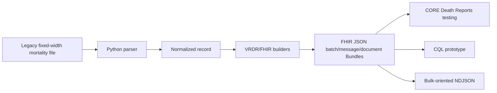

# FHIRBridge-MO

**Legacy Missouri-style mortality data → VRDR/FHIR R4 → cancer-registry interoperability testing**

FHIRBridge-MO is a synthetic-data public-health informatics MVP that explores whether a registry receiving a legacy fixed-width mortality file can translate selected fields into a standardized VRDR/FHIR structure for downstream cancer-registry death-clearance workflows.

The current project uses Python to parse a reduced Missouri-style fixed-width file, normalize selected fields, build VRDR/FHIR resources, assemble linked JSON Bundles, and create output for CDC Registry Plus CORE testing.

> **Current status:** A Missouri synthetic, template-aligned FHIR bundle using the two-record test data has been accepted by the CORE Death Reports FHIR import pathway. The latest standalone Python generator reproduces that accepted structural pattern without requiring a separate template JSON file. Repeatable testing of newly generated output and VRDR validation remain part of the MVP evaluation.

## Why this project exists

Cancer registries use mortality data to identify deaths, update vital status, link death reports to registry patients, investigate unmatched cancer-related deaths, and support death-certificate-only (DCO) follow-back.

Missouri's source mortality feed is a fixed-width file: the meaning of each value depends on its character position. FHIRBridge-MO provides a translation layer rather than requiring the source system to be replaced.



## Current MVP

The repository demonstrates:

- parsing of the current 245-character synthetic layout and an intended reduced 249-character layout;
- normalization of selected date and source values;
- mapping of selected mortality fields to FHIR/VRDR concepts;
- UUID-linked FHIR resource generation;
- a 24-resource CORE-aligned synthetic death-certificate document structure;
- generation of a new FHIR bundle **without an external template JSON dependency**;
- a prototype CQL rule for first-pass cancer-coded-death flagging; and
- resource-type NDJSON output for bulk-oriented testing.

### Selected source-to-FHIR mapping

| Source field | Meaning | FHIR / VRDR target |
|---|---|---|
| `certno` | Death certificate number | `Parameters.cert_no` + document identifier |
| `stmocd` | State / jurisdiction | `Parameters.jurisdiction_id` |
| `fname`, `lname`, `sex`, `dob` | Decedent identity | `Patient / vrdr-decedent` |
| `deathdate` | Date of death | `Observation / vrdr-death-date` |
| `por_name`, address, city, state, ZIP | Death institution / location | `Location / vrdr-death-location` |
| `cause` | Underlying ICD-10 cause of death | `Observation / vrdr-automated-underlying-cause-of-death` |

See [`mapping/SyntheticDCOtoFHIRmapping.csv`](mapping/SyntheticDCOtoFHIRmapping.csv) and [`docs/data-mapping.md`](docs/data-mapping.md).

## FHIR technologies

- **FHIR R4**
- **HL7 Vital Records Death Reporting (VRDR) v3.0.0**
- FHIR JSON Bundles
- CQL prototype packaged as a FHIR `Library`
- Bulk Data-aligned NDJSON prototype

SMART on FHIR and CDS Hooks are not required by the current batch-oriented public-health workflow.

See [`docs/fhir-resources.md`](docs/fhir-resources.md).

## Repository layout

```text
FHIRBridgeVitalStatistics-MO/
├── README.md
├── CHANGELOG.md
├── CITATION.cff
├── CONTRIBUTING.md
├── DISCLAIMER.md
├── LICENSE_STATUS.md
├── SECURITY.md
├── requirements.txt
├── .gitignore
├── .github/
│   ├── ISSUE_TEMPLATE/
│   └── PULL_REQUEST_TEMPLATE.md
├── src/
│   ├── create_mo_fhir_core_standalone.py
│   └── export_bulk_fhir_ndjson_jupyter.py
├── examples/
│   ├── MCR_DEATH_2024_SYNTHETIC.txt
│   ├── MCR_DEATH_2024_SYNTHETIC_MO_FHIR_CORE_TEMPLATE_ALIGNED.json
│   ├── MCR_DEATH_2024_SYNTHETIC_MO_FHIR_CORE_STANDALONE_TEST.json
│   └── bulk_ndjson/
├── mapping/
│   ├── SyntheticDCOtoFHIRmapping.xlsx
│   └── SyntheticDCOtoFHIRmapping.csv
├── cql/
│   ├── FHIRBridge_MO_Cancer_FollowBack_Prototype.cql
│   └── FHIRBridge_MO_CQL_Library.json
├── docs/
│   ├── architecture.md
│   ├── core-import-workflow.md
│   ├── data-mapping.md
│   ├── data-validation.md
│   ├── fhir-resources.md
│   ├── roadmap.md
│   ├── testing.md
│   └── ui-mockup.md
└── reference/
    └── README.md
```

## Quick start

### 1. Requirements

- Python 3.10+ recommended
- Anaconda/Jupyter optional
- The core converter uses only the Python standard library

### 2. Run the standalone converter

From a cloned repository:

```python
%run src/create_mo_fhir_core_standalone.py
```

The script automatically finds the synthetic input under `examples/` and creates:

```text
examples/MCR_DEATH_2024_SYNTHETIC_MO_FHIR_CORE_GENERATED.json
```

If you copy the script and input file into a separate Windows working folder such as `S:\FHIR\working folder2`, it can run there too:

```python
%run "S:\FHIR\working folder2\create_mo_fhir_core_standalone.py"
```

No separate `FHIRBridge_MO_CORE_ACCEPTED_TEMPLATE.json` file is required.

### 3. Test artifacts

- [`examples/MCR_DEATH_2024_SYNTHETIC.txt`](examples/MCR_DEATH_2024_SYNTHETIC.txt) — two synthetic fixed-width records
- [`examples/MCR_DEATH_2024_SYNTHETIC_MO_FHIR_CORE_TEMPLATE_ALIGNED.json`](examples/MCR_DEATH_2024_SYNTHETIC_MO_FHIR_CORE_TEMPLATE_ALIGNED.json) — Missouri synthetic bundle shaped to the CORE reference structure and used in successful parser/import testing
- [`examples/MCR_DEATH_2024_SYNTHETIC_MO_FHIR_CORE_STANDALONE_TEST.json`](examples/MCR_DEATH_2024_SYNTHETIC_MO_FHIR_CORE_STANDALONE_TEST.json) — example produced by the standalone generator

## CORE testing

During technical testing, the CORE Death Reports FHIR import pathway was confirmed to stage imported records in the Death Reports preprocessing area. Downstream patient matching, death-information updates, DCO release, and disposal/rejection are separate workflow actions.

A Missouri synthetic template-aligned bundle was accepted by the FHIR import pathway. **CORE parser acceptance and VRDR standards conformance are treated as separate questions.**

See [`docs/testing.md`](docs/testing.md) and [`docs/core-import-workflow.md`](docs/core-import-workflow.md).

## CQL prototype

[`cql/FHIRBridge_MO_Cancer_FollowBack_Prototype.cql`](cql/FHIRBridge_MO_Cancer_FollowBack_Prototype.cql) demonstrates a simple first-pass rule over the standardized underlying-cause Observation: flag a potential cancer-coded death when the ICD-10 code begins with `C`.

This is demonstration logic only. It is **not** the Missouri Cancer Registry's production DCO selection algorithm.

## Bulk-oriented NDJSON

[`src/export_bulk_fhir_ndjson_jupyter.py`](src/export_bulk_fhir_ndjson_jupyter.py) writes one resource per line, grouped by resource type.

Example outputs are under [`examples/bulk_ndjson/`](examples/bulk_ndjson/).

This demonstrates **Bulk Data-aligned NDJSON representation**; it is not a complete implementation of the server-side FHIR Bulk Data `$export` protocol.

## Planned interface

A Figma Make mockup has been created for a possible future configurable interface with source-file setup, layout definition, field-to-FHIR mapping, validation/preview, and export steps.

The Figma screen is a **future UI concept**, not the current working application. The current MVP runs in Python/Jupyter.

See [`docs/ui-mockup.md`](docs/ui-mockup.md).

## Data validation

The prototype checks supported fixed-width record lengths, parses/normalizes dates, verifies required identifiers and death dates, preserves FHIR resource roles, and checks the internal UUID reference graph before writing output.

See [`docs/data-validation.md`](docs/data-validation.md).

## Data safety

**Synthetic data only should be committed to this repository.**

Do not commit real death-certificate files, SSNs, patient names/addresses/dates, production database exports, credentials, API keys, or restricted internal configuration.

See [`SECURITY.md`](SECURITY.md).

## Known limitations

- The project uses a reduced synthetic mortality layout.
- The 245-character example and intended 249-character layout are not identical.
- The reduced source does not contain every data element found in a complete VRDR death certificate.
- Some values/resources in the accepted structural pattern are explicitly synthetic scaffolding.
- `state_auxiliary_id` is not present in the reduced source and is represented by a synthetic deterministic placeholder in the prototype.
- Successful CORE parsing/import does not establish complete VRDR conformance.
- The standalone generator's repeatable output should continue to be tested in a non-production CORE environment.
- The CQL rule is demonstration logic only.
- The NDJSON exporter is not a full Bulk Data `$export` implementation.

## Roadmap

1. Repeat CORE test imports from standalone-generated output.
2. Validate applicable resources against VRDR profiles.
3. Compare source fields to generated output for field-level fidelity.
4. Refine synthetic scaffolding as more source fields are mapped.
5. Execute and refine the CQL prototype.
6. Scale-test NDJSON with larger synthetic volumes.
7. Prototype a configurable/low-code mapping interface for reuse by other registries.

See [`docs/roadmap.md`](docs/roadmap.md).

## Project team

- **Nishant Jain, PhD, MS, MHA, FAMIA** — project concept, cancer-registry use case, source-to-FHIR mapping, initial prototype, and Registry Plus CORE coordination
- **Anirudh Kambhampati, MS** — student development, implementation/refinement, testing, validation, and documentation
- **Mohammad Beheshti, MSHI** — technical consultation, architecture, feasibility, and transformation methodology
- **Iris Zachary, PhD, MS, FAMIA, ODS-C** — scientific and cancer-registry oversight

## Acknowledgements

FHIRBridge-MO is informed by HL7 FHIR R4, the HL7 VRDR Implementation Guide, and CDC Registry Plus CORE Death Reports functionality/reference materials.

No endorsement by HL7, CDC, AMIA, the University of Missouri, or any other organization is implied.

## Citation

Citation metadata are provided in [`CITATION.cff`](CITATION.cff).

## License

This MVP prototype was created for the AMIA FHIR App Competition 2026. Please contact the project team before reusing or redistributing.

See [`LICENSE_STATUS.md`](LICENSE_STATUS.md) before reusing or redistributing the software.
