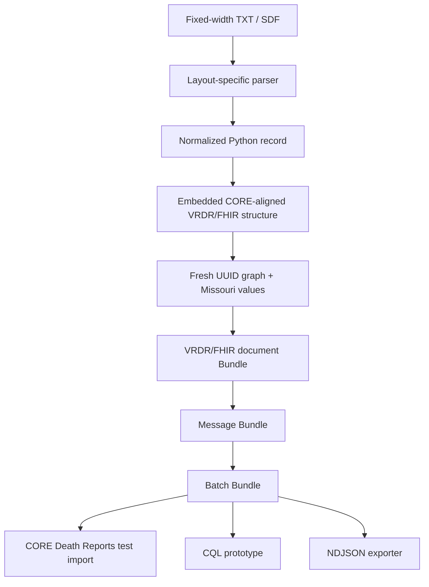

# Architecture

The source parser knows character positions; downstream FHIR-building logic
works with normalized semantic values.

The latest standalone converter embeds the structural pattern used in the
successful Missouri synthetic CORE test, so it no longer requires a separate
runtime template JSON file.

Supported reduced layouts: current 245-character synthetic layout and intended
reduced 249-character layout. They are not identical.
